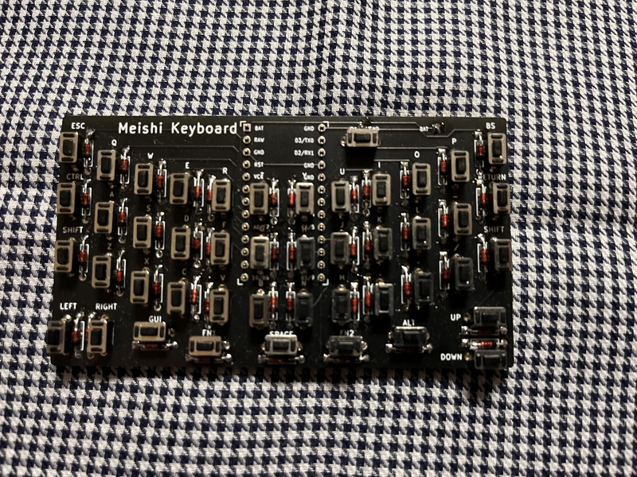
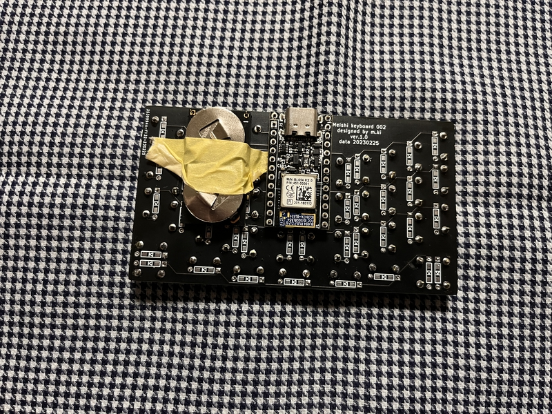

# Build guide

## Parts list

| No. | Patrs | Quantity | remarks | Suppliers | Cost |
|--|--|--|--|--|--|
|番号|名前|数|備考|調達先|参考価格（送料込）| 
|1|PCB|1|keyboard|[elecrow](https://www.elecrow.com) [JLCPCB](https://jlcpcb.com) [ALLPCB](https://www.allpcb.com)|5枚で5ドル| 
|2-1|pro micro|1|ピンヘッダ含む|[遊舎工房](https://yushakobo.jp) [Talp Keyboard](https://talpkeyboard.net) [Daily Craft Keyboard](https://shop.dailycraft.jp)等|価格変動中|
|2-2|BLE MIcro(Pro MicroサイズのUSB対応nRF52マイコンボード)|1|電池基板キットも含む|[遊舎工房](https://yushakobo.jp) [のぎすけ屋](https://nogikes.booth.pm)|１個4500円|
|3|Diode ダイオード|45|リードタイプ|[遊舎工房](https://yushakobo.jp) [Talp Keyboard](https://talpkeyboard.net) [Daily Craft Keyboard](https://shop.dailycraft.jp)等|100個で220円程度から|
|4|tactile switch|45|TVBP06-B043CB-B|[遊舎工房](https://yushakobo.jp) [Talp Keyboard](https://talpkeyboard.net) [Daily Craft Keyboard](https://shop.dailycraft.jp) [秋月電子通商](https://akizukidenshi.com/catalog/g/gP-08073/)|１個20円から|
この他に、USBケーブルが必要です。
  

## Firmware

[Here](https://github.com/telzo2000/meishi001/tree/main/firmware)

 
[remap](https://remap-keys.app/)

 
  

## Build

Please read it and then work on it.
 
一読してから、作業をしてください。
  

### Photo

Front side（表面） 

Back side(裏面) 

  

### 1 Diode soldering

Solder the diode on the front side.
 
表面にダイオードのハンダ付けをします。
 

 
 

### 2 Soldering switch

Solder the switch on the front side.
 
表面にスイッチのハンダ付けをします。
 

  

### 3-1 Pro micro（meishi001 or 002）

meishi001 or 002 are compatible with pro micro.
 
meishi001または002はpro microに対応しています。
 
 
The pro micro is attached using a pin header on the back.
 
pro microは裏面にピンヘッダを使って取り付けます。
 
 
Please refer to the photo for the orientation of the pro micro.
 
pro microの向きは、写真を参考にしてください。
 
 

### 3-2 BLE Micro(meshi002)

meishi002 supports BLE micro.
 
meishi002はBLE microに対応しています。
 
 
The pro micro is attached using a pin header on the back.
 
pro microは裏面にピンヘッダを使って取り付けます。
 
 
Please refer to the photo for the orientation of the pro micro.
 
pro microの向きは、写真を参考にしてください。
 
 
Assemble the battery board set and attach it to the position shown in the photo.
 
電池基板セットを組み立てて、写真の位置に取り付けてください。
 
 

### 5　Test

Please write the firmware and check the operation.
 
ファームウェアを書き込んで、動作確認をしてください。
 

Install a switch or measure continuity with tweezers, etc.
 
スイッチを取り付けるか、ピンセット等で導通をはかるかを行います。
 
 

Firmware

[github](https://github.com/telzo2000/meishi001/tree/main/firmware)

[remap](https://remap-keys.app/)

 
If you have a switch that doesn't respond, use a hot soldering iron to warm up the switch socket,diode and pro micro terminals.
 
もし、反応しないスイッチがあったら、温めたハンダゴテで、そのスイッチソケットやダイオード、pro microの端子を温めてください。
 
Also make sure the diode is oriented correctly.
 
また、ダイオードの向きが正しいか確認してください。
 

   

Have a fun selfmade keyboard life!
 
楽しい自作キーボード生活を! 

